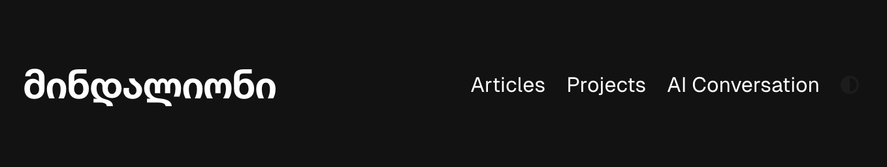

## Dokerized App - web site: mindalioni project

---


.

> [!NOTE]
> Still developing this site.


## Running Locally

Create a `.env.local` file similar to [`.env.example`].

`bash
PINECONE_API_KEY='your-api-secret-key'
PINECONE_ASSISTANT_NAME='your-assistant-name'

`

Then install dependencies and run the development server:
```sh-session
npm install
npm dev
```

---


RAG chat bot on board

--

> [!WARNING]
> This project serves solely to demonstrate development capabilities. 
> The content and messages conveyed through the texts and posts on this website do not reflect the developer’s personal views or ideology. 
> I merely created the website and implemented the content as requested.


<div align="center">
    <a href="https://ivanistereotekk.github.io/"><h1 align="center">IvanStereotekk-github-pages</h1></a>

Tecnological stack is: [Next.js](https://nextjs.org/), [Tailwind CSS](https://tailwindcss.com/)
</div>

<br/>
